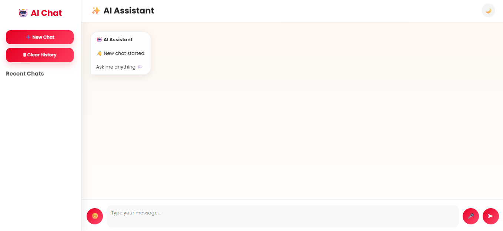
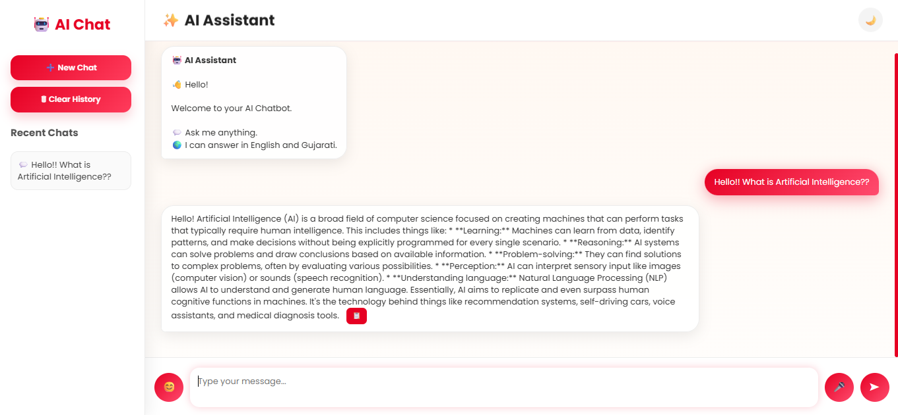
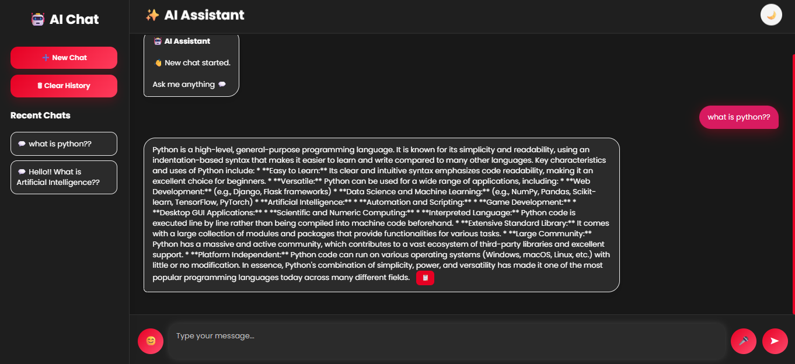

# 🤖 AI Chatbot

A modern AI chatbot built using **Flask**, **Google Gemini API**, **HTML**, **CSS**, and **JavaScript**. It features a clean Pinterest-inspired interface with dark mode, voice input, chat history, and multilingual support.

---

## ✨ Features

- 💬 AI-powered chatbot using Google Gemini
- 🌙 Dark / Light Theme
- 🎤 Voice Input
- 📋 Copy Response
- 🗂 Chat History (SQLite)
- 🆕 New Chat
- 🗑 Clear History
- 🌍 English & Gujarati Support
- 📱 Responsive Pinterest-style UI

---

## 🛠️ Technologies Used

- Python
- Flask
- Google Gemini API
- HTML5
- CSS3
- JavaScript
- SQLite
- python-dotenv

---

## 📂 Project Structure

```
AI-Chatbot/
│── app.py
│── .env
│── .gitignore
│── static/
│   └── style.css
│── templates/
│   └── index.html
```

---

## 🚀 Installation

1. Clone the repository

```bash
git clone https://github.com/RiddhiParmar26/AI-Chatbot.git
```

2. Install dependencies

```bash
pip install flask google-generativeai python-dotenv
```

3. Create a `.env` file

```env
API_KEY=YOUR_GEMINI_API_KEY
```

4. Run the project

```bash
python app.py
```

5. Open your browser

```
http://127.0.0.1:5000
```

---

## 📸 Screenshots

### Home Screen


### AI Chat


### Dark Mode


## 👩‍💻 Author

**Riddhi Parmar**

GitHub: https://github.com/RiddhiParmar26

---

⭐ If you like this project, please give it a Star!
